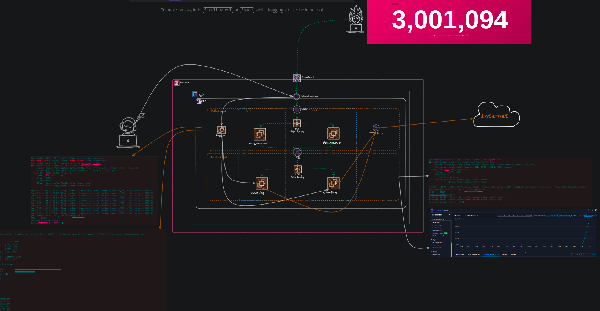

# Architecture





## Clone this repo
```sh
git clone https://github.com:soe-wai-lin/hc-session-2.git

cd hc-session-2

```

## Commentout Dashboard related terraform code in the following .tf files

### lb.tf ###
### output.tf ###
### launchtemplate.tf ###  
### autoscaling.tf ###

## Commentout all 
### cloudfront.tf ###

```sh
terraform init

terraform plan

terraform apply -auto-approve

```
If everything is success, uncomment Dashboard related terraform code. Copy counting ALB DNS from AWS and paste as Environment Variable into => dashboard.sh

Environment="COUNTING_SERVICE_URL=http://internal-counting-lb-1272789815.ap-southeast-1.elb.amazonaws.com"

```sh

terraform plan

terraform apply -auto-approve

```

## Note
In my case, I use key pair name "jenkins-key.pem". In your testing environment, you need to change your key pair name.


### THANK YOU !! 
